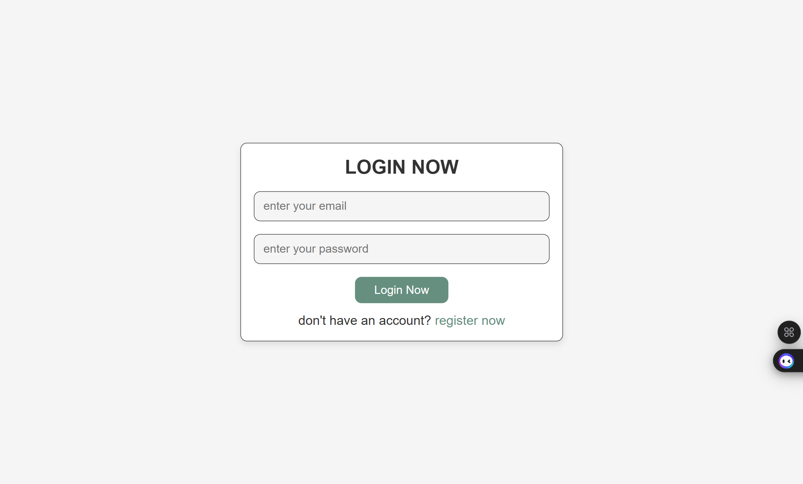
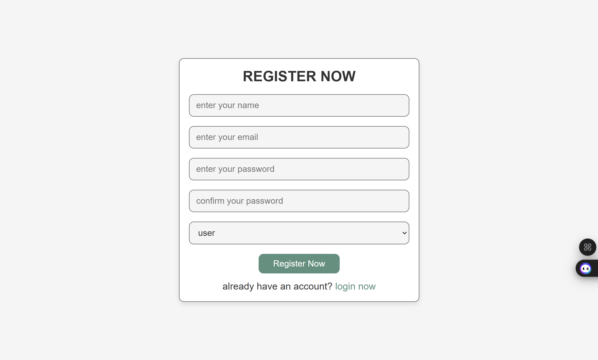
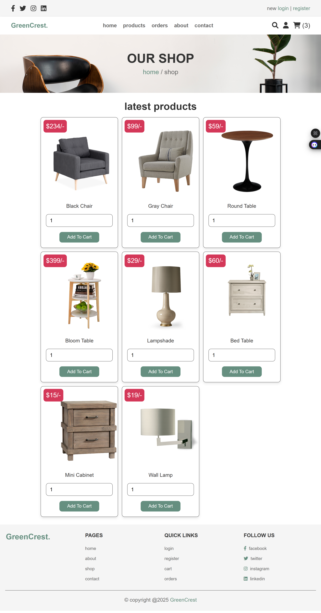
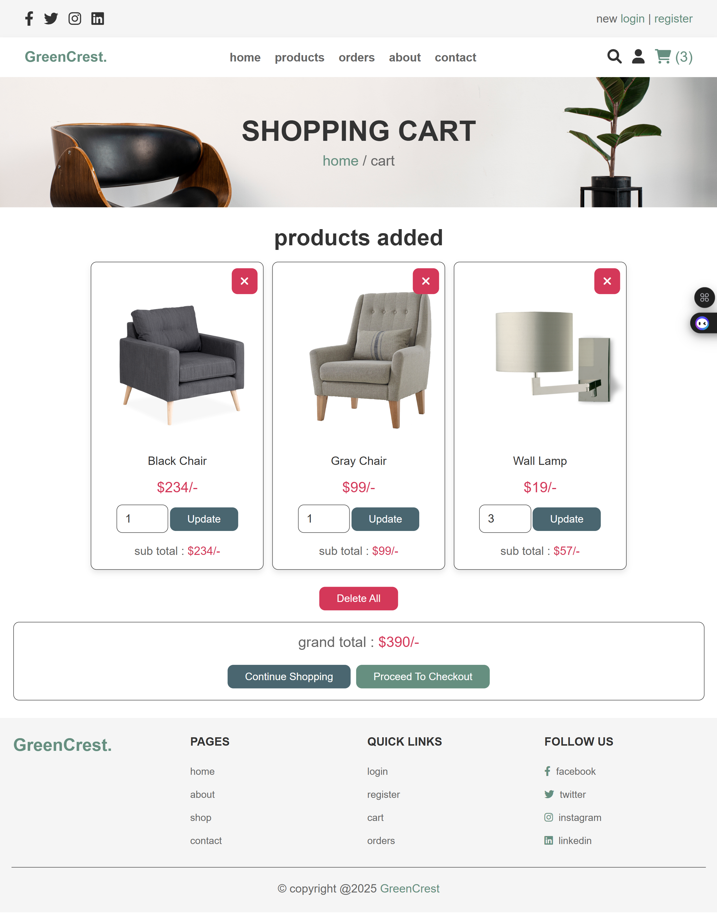
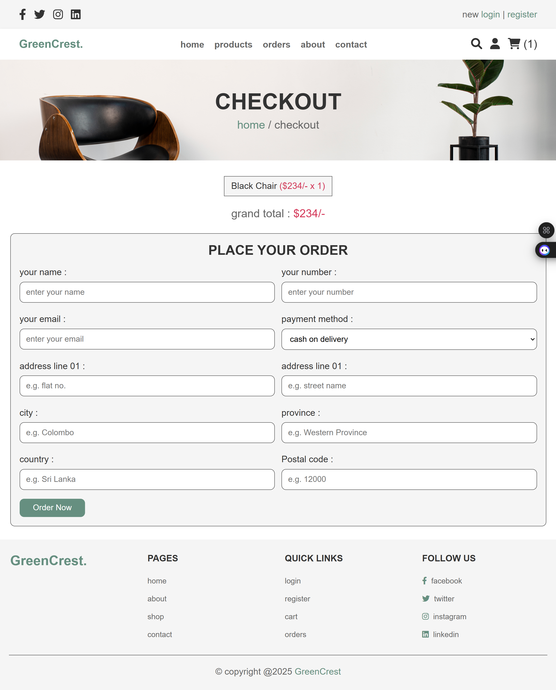
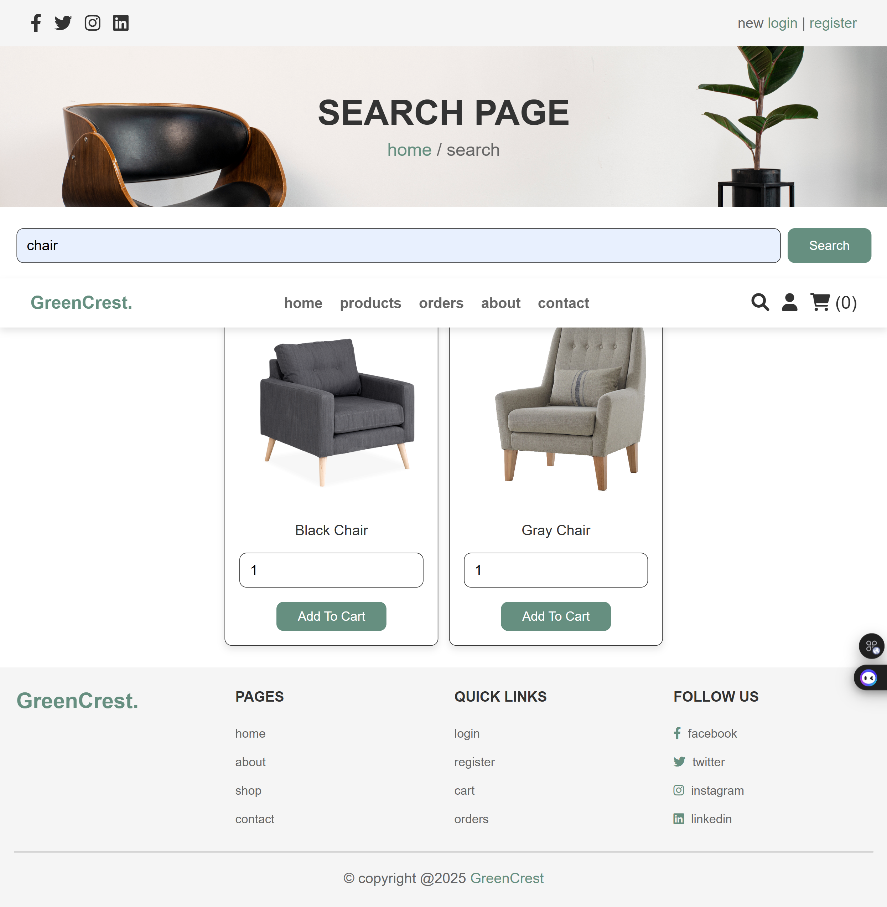
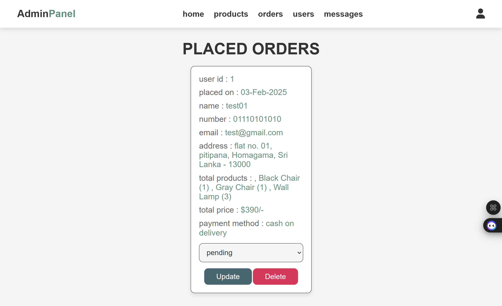

# Online Furniture Store Website

Welcome to the **Online Furniture Store** project! This is a PHP-based web application designed for buying and selling furniture online, featuring an intuitive UI, user authentication, and an easy-to-navigate shopping experience.

## 📸 UI Preview

### 🔑 Login Page


### 📝 Registration Page


### 🏠 Home Page


### 🛋️ Product Page


### ℹ️ About Us Page


### 📞 Contact Us Page


### 🛒 Cart Page


### 💳 Checkout Page


### 🏷️ Place Order Page


### 📦 Order Page


### 🔍 Search Page


### ⚙️ Admin Panel
#### 📊 Dashboard

#### ➕ Add Product

#### 📦 Manage Orders

#### ✉️ Messages

#### 👥 Manage Users


## 🌟 Features
- User authentication (Sign Up / Login / Logout)
- Browse and search for furniture products
- Add items to the cart and checkout
- Place and manage orders
- Admin panel to manage products, orders, and users
- Responsive design for a seamless experience on all devices

## 🛠️ Technologies Used
- **Frontend:** HTML, CSS, JavaScript, Bootstrap
- **Backend:** PHP, MySQL
- **Database:** MySQL

## 🚀 Installation

### Prerequisites
- Install **XAMPP** or **WAMP** for PHP and MySQL support

### Steps to Run the Project
1. Clone this repository:
   ```bash
   git clone https://github.com/yourusername/online-furniture-store.git
   ```
2. Move the project folder to `htdocs` (for XAMPP) or `www` (for WAMP)
3. Start **Apache** and **MySQL** in XAMPP/WAMP
4. Import the database:
   - Open `phpMyAdmin`
   - Create a new database (e.g., `furniture_store`)
   - Import the `database.sql` file from the project folder
5. Configure the database connection in `config.php`:
   ```php
   $servername = "localhost";
   $username = "root";
   $password = "";
   $dbname = "furniture_store";
   ```
6. Open the browser and visit:
   ```
   http://localhost/online-furniture-store
   ```

## 📂 Project Structure
```
📁 online-furniture-store
 ┣ 📂 css
 ┣ 📂 js
 ┣ 📂 images
 ┣ 📂 uploaded_img
 ┣ 📜 index.php
 ┣ 📜 config.php
 ┣ 📜 shop_db.sql
```

## 📝 License
This project is open-source under the MIT License.

---

Enjoy building your online furniture store! 🏡💺

